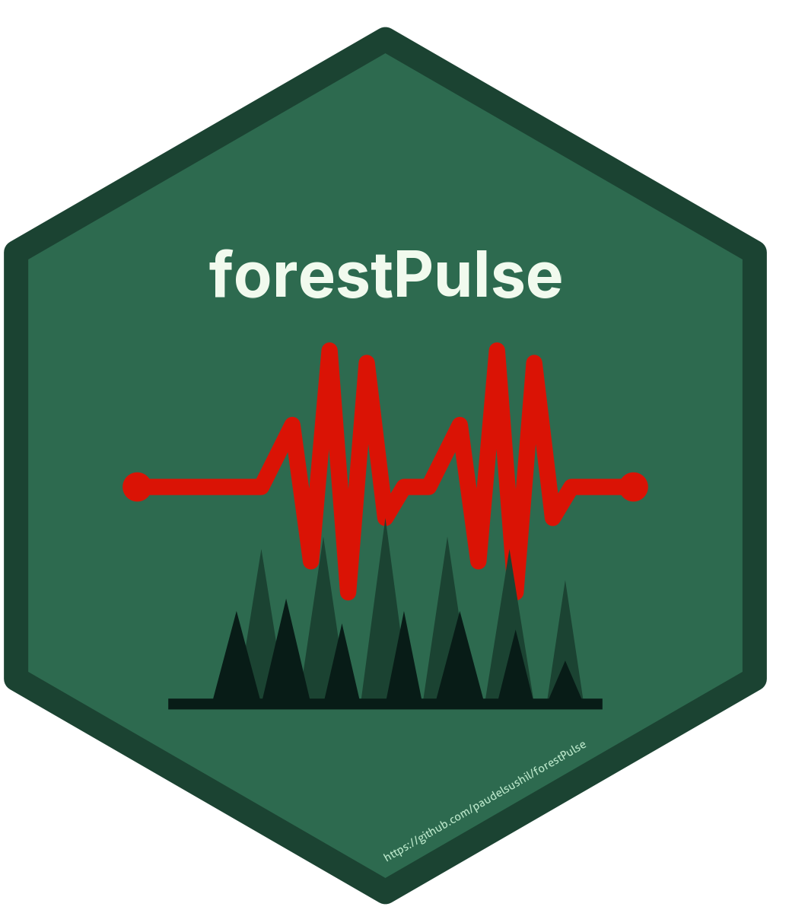

# forestPulse 

<!-- badges: start -->
[](https://CRAN.R-project.org/package=forestPulse)
[](https://cran.r-project.org/package=forestPulse)
[](https://cran.r-project.org/package=forestPulse)
[](https://opensource.org/licenses/MIT)
[](https://lifecycle.r-lib.org/articles/stages.html#experimental)
[](https://doi.org/10.5281/zenodo.17887640)
<!-- badges: end -->

## Overview

**forestPulse** is a toolkit for analysing forest structure and disturbance
from field measurements and remote-sensing imagery, **and** for assembling the
spatial and tabular inputs needed to drive a forest landscape simulation. It is
aimed at researchers, ecologists, and forest managers who move from field plots
and drone/satellite imagery through to quantitative analysis and, optionally,
process-based modelling with [iLand](https://iland-model.org).

The package covers two connected areas:

### 1. Field and remote-sensing analysis

- Index geotagged raster imagery into a spatial catalog and match it to field
  plots.
- Compute canopy structure metrics — canopy height models (CHM), canopy gaps,
  and per-plot gap geometry.
- Calculate RGB-derived vegetation indices from drone orthomosaics.
- Locate individual trees from compass bearings and distance measurements.
- Summarise plot-level forest structure (basal area, crown density, species
  composition) and standardise messy species names.

### 2. Forest landscape model (iLand) inputs

- Impute field plots to pixels (random-forest nearest-neighbour) to build
  wall-to-wall tree lists, and flag poorly-matched (extrapolated) pixels.
- Derive daily climate variables — vapour pressure deficit, radiation — from
  [gridMET](https://www.climatologylab.org/gridmet.html) data and write a
  per-cluster `SQLite` climate database in iLand's exact format.
- Build the stand grid, resource-unit environment grid and file, and the
  stand-grid tree-initialisation file, then cross-validate them — either step
  by step or through a single `build_iland_landscape()` call.

## Installation

### From CRAN (once released)

```r
install.packages("forestPulse")
```

### Development version from GitHub

```r
# install.packages("remotes")
remotes::install_github("paudelsushil/forestPulse")
```

Some capabilities use optional packages declared in `Suggests`: install
`RSQLite` for climate databases, `yaImpute` for plot-to-pixel imputation, and
`future`/`future.apply` for parallel spatial sampling.

## Quick examples

### Field and remote-sensing analysis

```r
library(forestPulse)

# 1. Build a spatial catalog of geotagged rasters and match it to field plots
catalog      <- build_catalog(input = "path/to/imagery", output = "catalog.geojson")
plots        <- sf::read_sf("plots.shp")
plot_imagery <- match_imagery(catalog, plots)

# 2. Canopy height model, then per-plot canopy gap metrics
chm     <- compute_chm("dsm.tif", "dtm.tif", output = "chm.tif")
metrics <- extract_plot_metrics(chm = chm, plots = plots,
                                radius = 15.24, gap_threshold = 3)

# 3. An RGB vegetation index and a plot-level basal-area summary
vegetation_index("ExG", image_path = "orthomosaic.tif")
calculate_basal_area(tree_table, summary = "plot")
```

### Preparing inputs for the iLand model

```r
# Daily climate from a gridMET extraction -> per-cluster SQLite climate database
clim <- gridmet_preprocessing(
  data        = gridmet_daily,   # one row per cluster-day
  cluster_col = "cluster",
  date_col    = "date",
  temp_unit   = "K",
  vpd_source  = "compute"        # derive VPD from temperature + humidity
)
write_iland_climate(clim, "database/climate.sqlite", split_col = "cluster")

# Stand grid + wall-to-wall tree initialisation via plot-to-pixel imputation
stand_grid <- create_stand_grid(stands, id_field = "stand_id",
                                filename = "gis/stand_grid.asc")
target     <- make_target_from_rasters(predictor_stack, stand_grid)
pixel_plot <- impute_plots_to_pixels(reference, target, predictors, responses)
build_iland_init(pixel_plot, tree_lists, out_path = "init/init_trees.txt")
```

## Function reference

### Analysis functions

| Topic                       | Functions                                                                                          |
| --------------------------- | -------------------------------------------------------------------------------------------------- |
| Raster catalog              | `build_catalog()`, `read_catalog()`, `query_catalog()`, `match_imagery()`, `footprint()`           |
| Canopy height               | `compute_chm()`                                                                                     |
| Canopy gaps                 | `classify_gaps()`, `gap_metrics()`, `extract_plot_metrics()`                                        |
| Vegetation indices          | `vegetation_index()` (37 RGB indices)                                                               |
| Tree location               | `locate_tree()`                                                                                     |
| Basal area & plot summaries | `calculate_basal_area()`, `calculate_species_basal_area()`, `calculate_plot_species_basal_area()`, `calculate_plot_summary()` |
| Crown density               | `calculate_crownDensity()`, `show_calculation_details()`, `plot_summary()`                          |
| Species standardisation     | `clean_species_names()`, `get_species_mapping()`, `check_unmapped_species()`, `compare_species_changes()` |

### iLand input functions

| Topic                       | Functions                                                                                          |
| --------------------------- | -------------------------------------------------------------------------------------------------- |
| Plot-to-pixel imputation    | `impute_plots_to_pixels()`, `make_target_from_rasters()`, `build_iland_init()`, `flag_far_imputations()` |
| Climate variables           | `calc_vpd()`, `calc_saturation_vapor_pressure()`, `convert_radiation()`                             |
| Climate database            | `gridmet_preprocessing()`, `write_iland_climate()`                                                  |
| Landscape input files       | `create_stand_grid()`, `create_environment_grid()`, `create_environment_file()`, `create_init_file()`, `validate_landscape()`, `build_iland_landscape()` |

### General utilities

| Topic                       | Functions                                                                                          |
| --------------------------- | -------------------------------------------------------------------------------------------------- |
| Sampling & features         | `create_samples()`, `create_binary_features()`, `create_timeclass()`                               |
| Raster/point extraction     | `extractValue2Points()`, `extract_and_rename_tifs()`                                                |

See the package documentation for full usage details:

```r
?forestPulse
help(package = "forestPulse")
```

## Citation

If you use **forestPulse** in published work, please cite it. To get the
current citation (with version) in R:

```r
citation("forestPulse")
```

> Paudel, S. (2026). *forestPulse: Analyse Forest Structure and Disturbance
> from Field and Remote Sensing Data*. R package.
> doi:[10.5281/zenodo.17887640](https://doi.org/10.5281/zenodo.17887640)

## Getting help

- Report bugs or request features through the project's GitHub repository.
- For questions about usage, please include a minimal reproducible example.

## Contributing

Contributions are welcome. Please open an issue to discuss substantial
changes before submitting a pull request. By participating in this project
you agree to abide by its terms of conduct.

## License

MIT © Sushil Paudel. See the [LICENSE](LICENSE) file for details.
